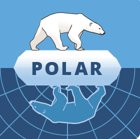

Polar (OSS)

Copyright 2024 Carnegie Mellon University.

NO WARRANTY. THIS CARNEGIE MELLON UNIVERSITY AND SOFTWARE ENGINEERING INSTITUTE
MATERIAL IS FURNISHED ON AN "AS-IS" BASIS. CARNEGIE MELLON UNIVERSITY MAKES NO
WARRANTIES OF ANY KIND, EITHER EXPRESSED OR IMPLIED, AS TO ANY MATTER
INCLUDING, BUT NOT LIMITED TO, WARRANTY OF FITNESS FOR PURPOSE OR
MERCHANTABILITY, EXCLUSIVITY, OR RESULTS OBTAINED FROM USE OF THE MATERIAL.
CARNEGIE MELLON UNIVERSITY DOES NOT MAKE ANY WARRANTY OF ANY KIND WITH RESPECT
TO FREEDOM FROM PATENT, TRADEMARK, OR COPYRIGHT INFRINGEMENT.

Licensed under a MIT-style license, please see license.txt or contact
permission@sei.cmu.edu for full terms.

[DISTRIBUTION STATEMENT A] This material has been approved for public release
and unlimited distribution.  Please see Copyright notice for non-US Government
use and distribution.

This Software includes and/or makes use of Third-Party Software each subject to
its own license.

DM24-0470

# Polar

  

## Background

### General Background
"Polar" is a play on the original "Mercator", as it was released by Lending Club, a set of agents designed to collect infrastructure data and load it into a graph, using Neo4J. The original [Lending Club Mercator](https://github.com/LendingClub/) agents were all built in Java, for an obsolete version of Neo4J, and is no longer publicly-available on Github.

Polar is a knowledge graph framework that takes inspiration from that original project, bringing with it modern ideas for software. Polar alters the original architecture to include pub/sub, mutual TLS, and external observation of services and infrastructure.

### Modular Workspace
The core workspace, located in the 'src' folder, serves as the foundation of Polar's modular architecture. This structure enables seamless integration of additional cargo projects, allowing for cohesive building of components. A simple `cargo build` command executed within the top-level workspace folder orchestrates the compilation of all sub-projects.

### Language Choice and Graph Independence
Polar agents are predominantly envisioned to be implemented in Rust, prioritizing versatility and independence from specific graph technologies. This approach aims to minimize direct dependencies on Neo4J, facilitating effortless interaction with the graph through a generalized interface. Users can flexibly select the desired graph implementation via a configuration file, paving the way for potential support of various graph types beyond Neo4J in the future.

## Additional Resources
* [Polar: Improving DevSecOps Observability](https://insights.sei.cmu.edu/blog/polar-improving-devsecops-observability/): Blog that provides comprehensive insights into Polar's architecture, components, and capabilities.
