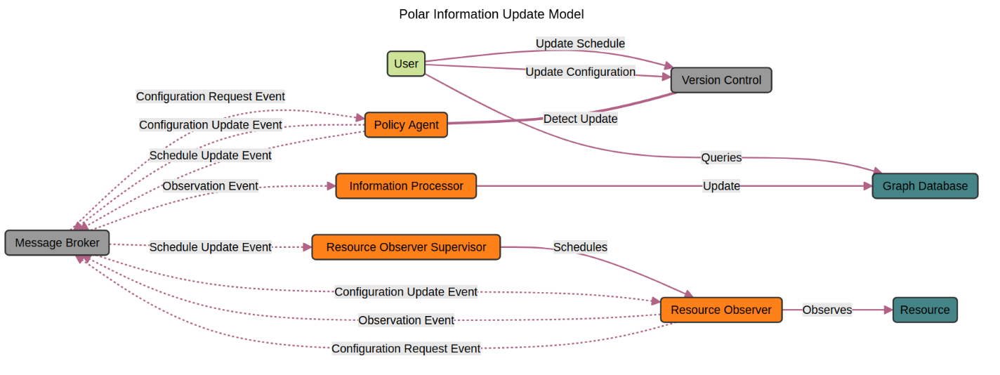

David Shepard

Morgan Farrah

Vaughn Coates

# Polar: Decision Making with Knowledge Graphs

# Abstract

In today\'s rapidly evolving mission landscape, the ability to process
and interpret complex data in real time is not just an advantage but a
necessity. This paper introduces a secure and scalable knowledge graph
framework, called Polar, designed to address the challenges posed by
building big data systems in highly regulated environments (HREs). Our
framework presents a secure-by-design architecture for advanced data
processing tasks and uses graph database technology to manage complex
data effectively and enable users to gain a clear view of their
organizational data and make timely decisions. Key highlights of the
framework include the robust security features, its adaptability to
various mission needs, and its ability to deliver timely and strategic
benefits. Investing in a robust implementation of a graph framework can
improve the observability of the operational environment and can lead to
enhanced decision-making processes, improved operational efficiency, and
many other possibilities.

One point of consideration while you are reading this article: this
framework was written to facilitate insights for a DevSecOps
organization, utilizing data available within their DevSecOps
environment. While the framework fits this particular use case very
well, we will attempt to speak more broadly about data, knowledge, and
mission needs, as the framework is truly generalizable and adaptable to
a diverse set of missions.

# Introduction

Organizations creating and operating software products operate in an
environment where data produced by their systems is voluminous and
ubiquitous, streaming from countless sources including network sensors,
access logs, user service interactions, software build processes, and
more. The sheer volume and complexity of this data can overwhelm
traditional data processing tools, making it difficult for organizations
to harness this information effectively. Paradoxically, these vast data
are often locked into tools that make it difficult to use the data in
ways that enable mission effectiveness. Without the right observability
framework, valuable insights hidden within these data streams can go
unnoticed, potentially leading to missed opportunities and suboptimal
mission performance.

Knowledge graphs represent a powerful solution for managing and
leveraging complex data. They organize information in a way that mimics
human cognitive processes - through interconnected nodes --- making
complex relationships understandable and navigable. By structuring data
into knowledge graphs, organizations can achieve a holistic view of
their information assets and use that visibility to respond more
dynamically to their operational environment.

This proposed knowledge graph architecture is specifically designed to
harness the potential of large data sets while addressing the challenges
of security, scalability, and integration within existing systems.
Technologically, it utilizes state-of-the-art graph databases and
real-time data processing frameworks to ensure that organizations can
not only store but also query and analyze data efficiently. From a
mission perspective, this architecture enables improved decision making
by providing deeper insights into behaviors, operational efficiency, and
trends. Moreover, its scalable nature ensures that as an organization
grows, its data processing capabilities can grow with it, without
compromising on performance or security.

## Data Analytics and Decision-Making Trends

In today\'s digital world, the tempo at which data is generated and then
needs to be processed has escalated dramatically. This surge is driven
by several factors, including the proliferation of mobile devices, the
rise of the Internet of Things (IoT) and other sensors, and the
increasing digitization of organizational processes across sectors.
Specifically, for organizations that produce software, modern DevSecOps
processes create a wealth of data that can be used to improve the tools
created for the enterprise, improve their robustness, and save money on
operational costs. Effective data processing is not just about speed but
also about the capacity to harness immediate insights for immediate
decisions. Failing to improve from traditional batch processing of data
inhibits your visibility and comprehension of the information produced
by DevSecOps practices to make conclusive decisions. Adapting to a
knowledge framework will allow organizations to engage in confident
informed decisions, streamlining the implementation of organizational
DevSecOps.

## Convergence Drives Better Outcomes

Alignment of mission strategies with progressive data technologies has
become a critical success factor for contemporary organizations.
Knowledge graphs, coupled with AI and machine learning, are at the
forefront of this convergence, offering new ways to interpret complex
data landscapes. This technological synergy is not just about managing
data but transforming it into a foundational asset for the mission.

Knowledge graphs, for example, provide a flexible, yet structured way to
store relationships within vast amounts of data, allowing for more
sophisticated semantic queries. These queries are integral to AI
applications that predict behaviors, optimize operations, and
personalize user interactions in real time. Furthermore, the
adaptability of knowledge graphs facilitates their integration into
various domains, enhancing their applicability across different
organizational units, from mission planning to supply chain management
and human resources.

Furthermore, the integration of these technologies within operations
catalyzes the development of a data-driven culture. This culture
prioritizes evidence-based decision-making and continuous learning from
data insights, which inherently drives better outcomes. Organizations
that successfully integrate these technologies can react more quickly to
changes, anticipate needs more accurately, and innovate more
effectively.

# Detailed System Overview

Polar's architecture is designed to efficiently manage and leverage
complex data within a mission context. It is built on several core
components, each integral to processing, analyzing, and visualizing data
in real time. Below is a simplified, yet comprehensive description of
these components, highlighting their technical workings and direct
mission implications.

## Architecture View

{width="6.472222222222222in"
height="2.4270833333333335in"}

Figure 1 - Polar Information Update Model

### Graph Database

At the core of the architecture is the graph database, which is
responsible for storing and managing data as interconnected nodes and
relationships. This allows us to model the data in a natural way, with
better alignment to the way organizations think about their data than is
possible with traditional relational databases. This alignment
facilitates more intuitive data query and analysis by organizations. The
use of a typical graph database implementation also means that the
schema is dynamic and can be changed at any time without requiring data
migration. The current implementation uses Neo4J due to its robust
transactional support and powerful querying capabilities through Cypher,
its query language. Plans to support ArangoDB are in the works.

### Pub/Sub Messaging System

A publish-subscribe (pub/sub) messaging system acts as the backbone for
real-time data communication within the architecture. This system allows
different components of the architecture, such as Resource Observers and
Information Processors, to communicate asynchronously. By decoupling
Observers from Processors, it ensures that any component can publish
data without any knowledge or concern for how it will be used. This
setup not only enhances the scalability but also improves the tolerance
of faults, security, and management of data flow.

The current implementation utilizes RabbitMQ. We had considered using
Redis pub/sub, as our system only requires basic pub/sub capabilities,
but had difficulty, due to the immaturity of the libraries used by Redis
for Rust supporting mutual TLS. This is the nature of active
development, and situations change frequently. This is obviously not a
problem with Redis, but with supporting libraries for Redis in Rust and
the quality of dependencies, ultimately the interactions played a bigger
role in our decision to utilize RabbitMQ.

### Configuration Management

Configuration management is handled using a version control repository.
Our preference is to use a private GitLab server, which stores all
configuration policies and scripts needed to manage the deployment and
operation of the system; however, the choice of DVCS implementation is
not important to the architecture. This approach leverages Git\'s
version control capabilities to maintain a history of changes, ensuring
that any modifications to the system\'s configuration are tracked and
reversible. This setup supports a GitOps workflow, allowing for
continuous integration and deployment (CI/CD) practices that keep the
system configuration in sync with the codebase that defines it.
Specifically, a user of the system, possibly an admin, can create and
update plans for the Resource Observers. The idea is that a change to a
YAML or JSON-defined policy document in version control can trigger an
update to the observation plan for a given Resource Observer. Updates
might include a change in observation frequency and/or changes in what
is collected. The ability to control policy through a version-controlled
configuration fit well within modern DevSecOps principles.

The integration of these components creates a dynamic environment in
which data is not just stored but actively processed and used for
real-time decision making. The graph database provides a flexible and
powerful platform for querying complex relationships quickly and
efficiently, which is crucial for decision makers who need to make swift
decisions based on a wide amount of interconnected data.

# Architecture Participants and Their Roles

The Polar architecture is built around several key participants, each
designed to fulfill specific functions within the system. These
participants seamlessly interact to collect, process, and manage data,
turning them into actionable insights.

## Observers

Observers are specialized components tasked with monitoring specific
resources or environments. They are deployed across various parts of the
business infrastructure to continuously gather data. Depending on their
configuration, Observers can track anything from real-time performance
metrics in IT systems to user interactions on a digital platform.

Each Observer is programmed to detect changes, events, or conditions
defined as relevant. These can include changes in system status,
performance thresholds being exceeded, or specific user actions. Once
detected, these Observers raise events that encapsulate the observed
data. Observers help optimize operational processes by providing
real-time data on system performance and functionality. This data is
crucial for identifying bottlenecks, predicting system failures, and
streamlining workflows. Observers can track user behavior, providing
insight into preferences and usage patterns. This information is vital
for improving user interfaces, customizing user experiences, and
improving application satisfaction.

## Information Processors

Information Processors are another name for what we used to call
Resource Observer Consumers, which is hard to say. They are responsible
for receiving events from Observers and transforming the captured data
into a format suitable for integration into the knowledge graph. They
act as a bridge between the raw data collected by Observers and the
structured data stored in the graph database. Upon receiving data, these
processors use predefined algorithms and models to analyze and structure
the data. They determine the relevance of the data, map it to the
appropriate nodes and edges in the graph, and update the database
accordingly.

## Policy Agents

Policy Agents enforce predefined rules and policies within the
architecture to ensure data integrity and compliance with both internal
standards and external regulations. They monitor the system to ensure
that all components operate within set parameters and that all data
management practices adhere to compliance requirements. Policy Agents
use a set of criteria to automatically apply rules across the data
processing workflow. This includes validating policy inputs and ensuring
that the correct parts of the system receive and apply the latest
configurations. By automating compliance checks, Policy Agents ensure
that the correct data is being collected and in a timely manner. This
automation is crucial in highly regulated environments where once a
policy is decided, it must be enforced. Continuous monitoring and
automatic logging of all actions and data changes by Policy Agents
ensure that the system is always audit-ready, with comprehensive records
available to demonstrate compliance.

# Security and Compliance

Security and compliance are primary concerns in the Polar architecture,
as a cornerstone for building and maintaining trust when operating in
highly regulated environments. Our approach combines modern security
protocols, strict separation of concerns, and the strategic use of Rust
as the implementation language for all custom components. The choice to
use Rust helps to meet several of our assurance goals.

First, Rust's package manager, "Cargo", gives us the ability to lock the
versions of all dependencies and quickly view them as a graph, using the
command "cargo tree". This is important for supply chain security. When
combined with other technologies, such as software bill of materials
(SBOM), we can easily track deployed versions of our entire dependency
tree over time, as potential problems are found and fixed.

Second, as much has been made of this fact, Rust is memory-safe by
default and prevents many common programming errors. Using compile-time
strong static type checking, and the implementation of a feature that is
unique to Rust, the 'borrow checker', which makes a strong case for
memory safety and security. An in-depth discussion of the borrow checker
is beyond the scope of this article, however, the borrow checker allows
Rust to claim independence from most common memory errors made by
programmers.

Additionally, Rust binaries are deployed as statically linked
executables. That means that all their dependencies are packaged with
the executable into a single binary image. This makes the relative size
of the binary potentially larger than a dynamically linked executable,
but it has the benefit that there is no guessing about the versions of
its dependencies. This has the effect of improving the overall stability
of code and security.

Finally, statically linked binaries greatly impact the number of
artifacts that get packaged into the deployed service container, since
basic tools like linkers are not even required for the running
executable. The smaller footprint of ancillary tools in the deployment
environment helps to reduce the overall attack surface of the system.

The use of Linux Containers for the deployment has the effect of
sandboxing the executable from access to other processes running on the
host system, using kernel-enforced isolation mechanisms. Linux
containers are another topic that is beyond the scope of this article,
but it is worth mentioning that each container functions independently
with its own slice of system resources. Siloing the containers prevents
any potential breach to a single component without risking the entire
host system. Deploying components in securely isolated containers
minimizes the risk of data leaks and breaches. Such security measures
are designed to meet and exceed many compliance standards. Compliance is
further supported by the traceability and auditability features inherent
in properly configured containerized environments.

Another security feature is the near-ubiquitous use of mutual TLS. We
secure all data in transit between components with mutual TLS, ensuring
that both parties in a communication verify each other's identities
before data exchange. This rigorous authentication process is vital for
preventing man-in-the-middle attacks. It has the effect of requiring all
service accesses of any kind to first be authenticated via two-party,
strong encryption.

# Deployment, Scalability, and Integration

The deployment, scalability, and integration of the Polar architecture
are designed to be smooth and efficient, ensuring that missions can
leverage the full potential of the system with minimal disruption to
existing processes. This section outlines practical guidelines for
deployment, discusses scalability options, and explains how the
architecture integrates with various IT systems.

## Guidelines for Deployment

The architecture is designed with modularity at its core, allowing
components such as Observers, Information Processors, and Policy Agents
to be deployed independently based on specific business needs. This
modular approach not only simplifies the deployment process but also
helps isolate and resolving issues without impacting the entire system.

The deployment process can be automated for any given environment,
through scripts and configurations stored in version control, and
applied using common DevSecOps orchestration tools, such as Docker and
Kubernetes. This automation supports consistent deployments across
different environments and reduces the potential for human error during
setup, but just as importantly, automated, and modular deployment allows
organizations to quickly set up and test different parts of the system
without major overhauls, reducing the time to value. The ability to
deploy components independently provides flexibility to start small and
scale or adapt the system as needs evolve. In fact, starting small is
the best way to begin with the framework: Choose an area to begin
observing that would provide immediately useful insights. Combine these
with additional data as they become available.

## Scalability Considerations

The system is built to support both horizontal and vertical scaling.
This means that organizations can increase the capacity of the
architecture by either adding more hardware resources (vertical scaling)
or by adding more instances of specific components (horizontal scaling).
As data demands grow, the architecture can scale to meet increased loads
without degrading performance, ensuring that the system grows with the
needs of the mission. Scalable systems can adjust resources used based
on current needs, which can significantly reduce costs related to
over-provisioning and underutilization. We had considered deployment
using Actors, which provide a different paradigm for concurrency.
However, most Actor frameworks do not provide the stronger isolations
offered by deploying components using Linux Containers, but explorations
into the exceptions of this are areas of future work.

## Integration with Existing Infrastructures

The architecture utilizes existing service APIs for networked services
in the deployed environment to query information about that system. This
approach is considered as minimally invasive to other services as
possible. An alternative approach that has been taken in other
frameworks that provide similar functionality is to deploy 'active
agents', agents that are deployed adjacent to the services they are
introspecting. These agents can operate, in many cases, transparently to
the services they are observing. The trade-off is that they require
higher privilege levels and access to information, and their operations
are not as easily audited. APIs generally allow for secure and efficient
exchange of data between systems, enabling the architecture to augment
and enhance current IT solutions, without compromising security.

Some Observers are provided and can be used with minimal configuration,
such as the GitLab Observer. However, to maximize the use of the
framework, it is expected that additional Observers will need to be
created. The hope is that eventually, we will have a repository of
Observers that fit the needs of most users.

# Schema Development and Information Architecture

The success of a knowledge graph architecture significantly depends on
how well it represents the processes and specific data landscape of an
organization. Developing custom organization-specific schemas is a
critical step in this process. These schemas define how data is
structured, related, and interpreted within the knowledge graph,
effectively modeling the unique aspects of how an organization views and
utilizes its information assets.

## Custom Schema Development

{width="6.5in"
height="3.582638888888889in"}

Figure 2 - Custom Organizational Schema Facilitates Business Use Cases

Custom schemas allow data modeling of data in ways that closely align
with an organization's operational, analytical, and strategic needs.
This tailored approach ensures that the knowledge graph reflects the
real-world relationships and processes of the business, enhancing the
relevance and utility of the insights it generates. A well-designed
schema facilitates the integration of disparate data sources, whether
internal or external, by providing a consistent framework that defines
how data from different sources are related and stored. This consistency
is crucial to maintain the integrity and accuracy of the data within the
knowledge graph.

## Role of the Information Architect

Information architects play a key role in the development of a custom
schema. They work to understand the data needs of various stakeholders
within the organization and translate these needs into a coherent schema
that supports current and future data usage scenarios. These
professionals must have a deep understanding of both the technical
aspects of knowledge graphs and the business contexts in which they
operate. This includes expertise in data modeling, metadata management,
and an understanding of the business processes and rules that govern
data usage within the organization. This function is a huge part of the
reason you cannot simply buy an observability tool and start using it,
as curating data and making it useful to a specific organization
requires subject-matter expertise/domain knowledge. Information
architects also facilitate collaboration between IT and business units.
They help bridge the gap between technical data management practices and
mission objectives, ensuring that the schema supports the strategic
goals of the organization. By leading discussions and workshops with
stakeholders from various parts of the organization, information
architects gather requirements and feedback that inform the ongoing
refinement of the Polar schema.

### Governance and Evolution of the Schema

Beyond initial development, information architects are responsible for
the governance of the schema, managing how it evolves in response to new
needs, changes in data sources, or changes in strategic direction. They
ensure that modifications to the schema are managed systematically and
that all changes align with broader data governance policies and
standards.

# The Platform-Independent Model for DevSecOps (PIM)

In addition to schema development by the Information Architect, there
are pre-existing models for how to think about your data. For example,
for DevSecOps organizations, there exist models such as 'The
Platform-Independent Model for DevSecOps'. This model was developed at
Carnegie Mellon University's Software Engineering Institute and provides
a method to think about the requirements for DevSecOps and how to apply
them to your specific organization. The model can also be used to begin
creating a schema to organize information about a DevSecOps
organization, something we have used it for with Polar with our
customers. More information on the PIM can be found here:
<https://cmu-sei.github.io/DevSecOps-Model/>

# Mission Use Cases and Decision-Making

The practical application of the Polar architecture across various
domains demonstrates its ability to transform data into actionable
insights, thereby enhancing decision-making processes. This section
presents detailed examples showing how the system could be used, for
example, to forecast financials, human resources planning, and risk
management.

## Financial Forecasting from Real-Time Cloud Utilization

### Scenario:

Company profile: A large e-Commerce company that utilizes cloud
computing extensively to manage its digital operations, including data
storage, customer transactions, and analytics processes.

Challenge: Managing cloud costs efficiently while ensuring optimal
performance and scalability during peak periods such as holiday sales
events.

Solution: The company implements the Polar architecture to monitor and
analyze real-time data on cloud resource utilization. By integrating
Observers across their cloud infrastructure, the company gains instant
visibility into usage patterns and system demands.

### Outcomes:

Dynamic Cost Management: Using insights generated by the knowledge
graph, the company can dynamically allocate resources using automation
that uses the available graph knowledge, avoiding overprovision while
ensuring sufficient capacity for periods of high demand. Such a
real-time adjustment could lead to significant cost savings and improved
system responsiveness.

Improved Financial Forecasting: The architecture enables predictive
analytics based on historical data trends and real-time input, improving
the accuracy of financial forecasts related to cloud expenditure.

## Strategic HR Planning

### Scenario:

Company profile: A multinational corporation with diverse teams
distributed throughout the world engaged in various complex projects.

Challenge: Efficiently managing human resources to optimize productivity
and prevent employee burnout.

Solution: Implement the knowledge graph to analyze data on employee
workloads, project timelines, and performance metrics. The system uses
Information Processors to process data collected from HR systems and
project management tools, populating the graph with insights about
workload distribution and resource allocation.

### Outcomes

Enhanced HR Operations: The insights provided by the knowledge graph
enable HR managers to identify employees at risk of burnout and
reallocate tasks more evenly. This proactive management helps to
maintain high morale and productivity.

Data-Driven Resource Allocation: Strategic planning is improved as the
company uses data to guide decisions on hiring, team composition, and
project assignments, ensuring that the right resources are available
where they are most needed.

## Risk Management Through Continuous Monitoring

### Scenario:

Company profile: A financial services provider that must adhere to
compliance regulations and protect sensitive client data.

Challenge: Continuously monitoring large amounts of security logs and
compliance data to detect and respond to potential threats or breaches
promptly.

Solution: Polar Architecture deployment to integrate and analyze
security data in real time. Policy Agents are used to ensure that
compliance rules apply automatically and flag anomalies, while Observers
collect data across systems.

### Outcomes:

Proactive Risk Mitigation: The architecture enables the company to
detect and respond to anomalies as they occur, significantly reducing
the potential impact of security threats.

Regulatory Compliance: Automated compliance monitoring ensures that the
company remains in compliance with financial regulations, avoiding
potential fines and legal issues.

# Potential Business Concerns

Although the adoption of an advanced knowledge graph architecture offers
significant benefits, it also raises several potential concerns for
businesses. These concerns typically revolve around technical
complexity, cost implications, and ongoing maintenance. Addressing these
effectively is crucial for successful implementation and operation.

### Challenge:

Implementing a knowledge graph architecture involves integrating complex
components such as graph databases, pub/sub messaging systems, and
dynamic policy agents, which can be daunting, especially for
organizations without substantial in-house technical expertise.

### Solutions:

Partnerships with Technology Providers: Collaborate with experienced
vendors who specialize in knowledge graph technologies to assist with
setup, customization, and training.

Incremental Implementation: Start with a pilot project that focuses on a
critical but manageable business area to allow IT staff to become
familiar with the technology before a full-scale rollout.

Comprehensive Training Programs: Invest in training programs to train
existing IT personnel, focusing on the specific technologies used within
the architecture.

### Challenge:

The initial setup of a knowledge graph system, including software
acquisition, hardware requirements, and personnel training, can be
costly. Additionally, the ongoing expense of maintaining and scaling the
system can affect the ROI.

### Solutions:

Cost-Benefit Analysis: Conduct a comprehensive cost-benefit analysis to
understand the potential ROI of improved decision-making capabilities
and operational efficiencies.

Cloud-Based Solutions: Consider using cloud-based services for the
deployment of the Polar architecture to reduce upfront capital
expenditures and benefit from scalable, pay-as-you-go pricing models.

Seek Financial Incentives: Explore potential grants, tax incentives, or
partnerships that can offset initial costs, particularly those available
for technological innovation and digital transformation projects.

## Maintenance and Scalability

### Challenge:

Maintaining an advanced knowledge graph architecture requires ongoing
management of data quality, system updates, and infrastructure scaling,
which can strain resources.

### Solutions:

Automated Maintenance Tools: Implement tools that automate routine
maintenance tasks, such as data validation, backups, and performance
monitoring, to reduce the workload on IT staff.

Scalability planning: Design the architecture with scalability in mind
from the outset, using modular components that can be scaled
independently to meet growing data needs without a complete system
overhaul.

Dedicated Technical Team: Establish a dedicated team responsible for the
ongoing management of the Polar framework, ensuring that the
architecture continues to meet the evolving needs of the business
efficiently.

# Future directions and technology trends

The continued integration of AI and machine learning will enhance the
ability of the knowledge graph to provide predictive analytics, automate
complex decision-making processes, and provide deeper insights, through
integration of features utilizing large language models fine-tuned to
support graph query languages. Future developments might include more
advanced natural language processing capabilities to interpret and
organize unstructured data directly into the knowledge graph.

Increased use of edge computing will allow for more decentralized data
processing, reducing latencies, and enhancing real-time data processing
capabilities at the source of data generation.

In addition to the primary sources of data that Polar ingests, the
Observers that are pulling data from various system resources and the
Information Processors that load data into the graph, it is entirely
possible, and potentially valuable, to create derivative nodes and
relationships within the model, based on the data that is present. These
could be simple composites that bring together complex queries as a
simple sort of view, or they could be new nodes that use features, such
as AI, to add predictions to the graph that can be trended over time,
for example. The possibilities are vast. Organizations can leverage
real-time data processed through Polar to personalize customer
interactions and predict future behaviors, thus enhancing customer
engagement and satisfaction. The ability to rapidly analyze and act on
data will allow businesses to explore new models such as dynamic
pricing, real-time resource allocation, and predictive maintenance
services, providing a significant competitive edge. An obvious area of
future development for Polar involves creating variations of Resource
Observers and Information Processors to handle the complexity of the
industry's common operating environments. This would make the framework
more useful and adaptable for organizations as an out-of-the-box
observability solution.

Engaging in partnerships in different sectors can lead to the
development of shared knowledge graphs that enhance the scope and depth
of the insights available to all participants. By contributing to and
utilizing open innovation platforms, organizations can access a broader
community of developers and analysts, accelerating the innovation cycle
and discovering new uses of their data.

# Conclusion

The development and deployment of the Polar architecture represents a
significant advancement in the way organizations handle and derive value
from their data. Throughout this paper, we have explored the intricate
details of the architecture, demonstrating not only its technical
capabilities, but also its potential for profound impact on operations
and decision-making processes. The Polar architecture is not just a
technological solution, but a strategic tool that can become the
industry standard for organizations looking to thrive in the digital
age. Using this architecture, highly regulated organizations can
transform their data into a dynamic resource that drives innovation and
a sustainable competitive advantage.
