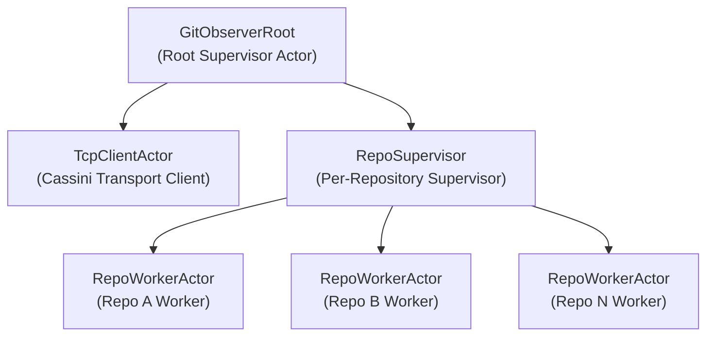

# Git Repository Agent Architecture

## Git Repo Observer

This system is structured as a **fact-emitting observer** coupled to **independent processors** via a message broker. The core principle is separation of *observation* from *interpretation*. Git repositories are observed once, facts are emitted exactly as seen, and all meaning-making (graph construction, enrichment, correlation) happens downstream.

### High-level structure

The Git observer is an actor-based system with a strict supervision tree:

* **GitObserverRoot** is the root supervisor.
* A single **TcpClientActor** owns the connection to the Cassini message broker.
* A **RepoSupervisor** manages one **RepoWorkerActor** per configured repository.

Each `RepoWorkerActor` operates on a **bare repository** and performs bounded, incremental observation:

* Fetches updates from configured remotes.
* Walks commits per ref using checkpoints and depth limits.
* Emits observation events, but never mutates shared state or writes to storage.

All observed data is published to Cassini. The observer does not know who consumes it.

### Event model and responsibilities

Two first-order Git events are emitted:

* **CommitDiscovered**

  * Emitted when a commit object is observed during a walk.
  * Contains immutable commit facts (OID, parents, message, timestamps, committer).
  * Does *not* imply branch or tag semantics.

* **RefUpdated**

  * Emitted when a ref moves from one OID to another.
  * Represents human-meaningful pointers (branches, tags).
  * Encodes *change*, not history.

This split is intentional and non-negotiable. Commits are timeless DAG nodes; refs are mutable pointers. Conflating them produces incorrect graphs and self-referential edges.

### Downstream processing

Independent processors subscribe to Cassini and build meaning from the event stream:

* **Git Repo Processor**

  * Consumes `CommitDiscovered` and `RefUpdated`.
  * Writes canonical Git structure into Neo4j.
  * Treats events as unordered and idempotent.

* **External Info Processors**

  * Peer producers/consumers on the same broker.
  * May enrich or correlate Git data with external systems.
  * Write directly to Neo4j without routing through the observer.

All processors are intentionally decoupled from the observer. Failure or restart of a processor does not impact observation.

### Graph modeling decisions

Graph writes are driven by event type, not by convenience:

* `CommitDiscovered` generates:

  * Repository node (upsert)
  * Commit node (upsert)
  * `(:Repository)-[:CONTAINS]->(:Commit)`
  * `(:Commit)-[:PARENT]->(:Commit)` edges (guarded against self-loops)

* `RefUpdated` generates:

  * Ref node (upsert)
  * Commit node (upsert, if missing)
  * `(:Ref)-[:POINTS_TO]->(:Commit)` edge
  * Optional edge metadata (e.g. observation time)

Ref edges are **never** created during commit discovery. This avoids incorrect assumptions about branch membership and fixes self-referential parent bugs caused by ref-scoped walking.

### Key architectural constraints

* Observation is bounded, incremental, and side-effect free.
* The message broker is the system’s backbone, not a transport detail.
* No component assumes event ordering.
* Graph writes must be idempotent and tolerant of partial knowledge.
* Meaning is derived downstream, not at the point of observation.

### Why this matters

This design trades immediacy for correctness and extensibility. By emitting raw facts and deferring interpretation, the system avoids hard-coding assumptions about Git semantics, supports multiple concurrent processors, and allows the graph model to evolve without touching the observer.

In short: the observer reports reality; processors argue about what it means.
