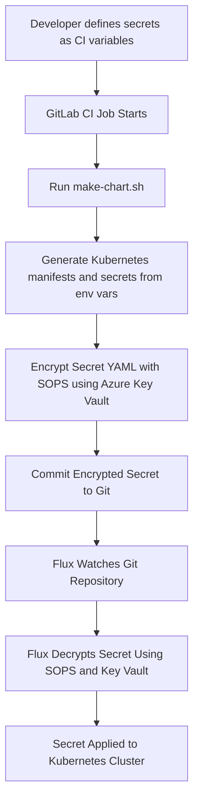

# Secrets Management with SOPS and CI

## Overview

This document outlines our strategy for managing Kubernetes secrets in our GitOps workflow using [SOPS](https://github.com/getsops/sops), GitLab CI, and Azure Key Vault. Our goal is to encrypt all secret values before they are committed to version control, supporting a workflow that is auditable, secure, and automation-friendly.

---

## Why This Approach?

- **Visibility**: All changes to secrets are captured in Git history. This enables traceability and auditability, both critical for compliance and debugging.
- **Simplicity**: We reduce infrastructure dependencies by avoiding in-cluster operators. The secrets lifecycle is managed through Git and CI/CD.
- **Access Control**: GitLab provides granular controls over repository access and CI/CD environment variables, centralizing responsibility.
- **Automation**: Secrets are generated from environment variables in CI, encrypted with SOPS using a key stored in Azure Key Vault, and then committed back to the repository.

---

## Secrets Flow

1. Secrets are defined via environment variables.
    - During local testing, variables read from an env file can be used to generate kubernetes secrets, eliminating the need to create them before generating the chart.
    - SOPS then encrypts each secret using keys from our selected key vault.
2. **GitLab CI job** runs the `make-chart` script which:
   - Renders the Helm chart from Dhall or templates.
   - Extracts secret values from environment variables.
   - Writes Kubernetes `Secret` YAML files to disk.
   - Encrypts them with SOPS using Azure Key Vault.
3. The encrypted secrets are committed and pushed back to the polar-deploy repository.
4. Flux watches the repository, decrypts secrets using SOPS with access to the same Key Vault, and applies them to the cluster.

---

## Encryption Details

- Secrets are encrypted using a **KMS key from Azure Key Vault**.
- The `.sops.yaml` policy defines which files to encrypt and how (e.g., by file path or pattern).
- Decryption in CI and Flux is handled by giving them identities that can access the Key Vault.

---


## Re-encrypting Secrets After Key Rotation

When a key in Azure Key Vault is rotated, any secrets previously encrypted with the old key must be re-encrypted using the new key to remain decryptable by Flux.

To do this:

1. **Update the SOPS configuration**: Update your `.sops.yaml` or `.sops.yml` file to reference the new Azure Key Vault key ID.

2. **Re-encrypt with the new key**: Re-run the CI/CD with the updated config to encrypt secrets

To maintain zero-touch, airtight security hygiene, our workflow will automate re-encryption of all SOPS-encrypted secrets in response to Azure Key Vault key rotation. When a key is rotated, GitLab CI/CD should be triggered to re-encrypt secrets using the new key version and commit them back to the source repository.

This way, secrets stay valid and encrypted, we get to avoid decryption errors during flux syncs, and key material is rotated frequently and automatically consumed.

To do this, we'll follow these two steps.

1. **Enable Key Rotation Notifications**  
   Azure Key Vault supports [Event Grid](https://learn.microsoft.com/en-us/azure/key-vault/general/event-grid-overview) integration. So we'll enable events for the key vault!

2. **Create a GitLab Webhook Endpoint**
   We'll need a secure intermediary or self-hosted function to:
   - Receive the Event Grid payload
   - Confirm it's a `Microsoft.KeyVault.KeyNewVersionCreated` event
   - Trigger a **GitLab CI pipeline** using the [GitLab API](https://docs.gitlab.com/ee/api/pipeline_triggers.html)

   Example (Node.js or Azure Function):
   ```bash
   curl -X POST \
     -F token=$GITLAB_TRIGGER_TOKEN \
     -F ref=main \
     https://gitlab.com/api/v4/projects/<project-id>/trigger/pipeline
   ```

3. **Commit the changes**: Once re-encrypted, the CI runner will commit the updated files, resulting in auditable secret changes.

4. **Flux will detect the change**: Flux will apply the updated secrets using the new key in its environment.

This process can be incorporated into a CI job or a manually triggered script to simplify operational workflows and ensure secrets remain valid after key rotation.


---

## Summary

### Alternative Patterns for Non-Azure Users

If you're not using Azure Key Vault, the automation can still be achieved through alternative triggers:

| Platform        | Strategy                                                                 |
|----------------|--------------------------------------------------------------------------|
| **AWS KMS**     | Use [CloudWatch Events + Lambda](https://aws.amazon.com/blogs/security/how-to-automate-key-rotation/) to trigger secret re-encryption via the GitLab API. |
| **GCP KMS**     | Use **Cloud Functions + Pub/Sub** to listen to new key version creation events and trigger CI pipelines. |
| **HashiCorp Vault** | Use Vault’s audit log or [sentinel policies](https://developer.hashicorp.com/vault/docs/concepts/policies#sentinel-policies) to detect key updates and push to GitLab. |
| **Age with GitOps-only** | Rotate keys on a schedule (e.g., monthly) and automate a re-encryption run via cronjobs or scheduled GitLab pipelines. Store rotated keys in a secure Git repo or KMS-backed vault. |

### Benefits of Automating Key-Based Secret Re-Encryption
- Eliminates drift between key versions and encrypted data
- Maintains Git as the source of truth without human interaction
- Encourages frequent key rotation without breaking deployments


### ✅ Pros
- **Immutable history** of secrets changes with full context.
- **No need to run or trust in-cluster secret operators** (e.g., External Secrets or Sealed Secrets).
- **CI/CD flow remains declarative and secure**, aligning with GitOps principles.
- **Flexible key rotation**, since encryption is externalized via Key Vault.

### ❌ Cons
- **Key management complexity** must be handled externally (e.g., securely rotating keys in Azure).
- **Encrypted files will still create Git churn**, though this is considered a feature for visibility, all changes need to be auditable and justified.
- **Some manual overhead**, especially around tooling setup and file generation if not automated properly.

---

## Future Considerations

If our trust model changes or we begin adopting external secret backends in other systems (e.g., HashiCorp Vault, AWS Secrets Manager), we may consider moving to [External Secrets Operator](https://external-secrets.io) for a more dynamic pull-based model.

