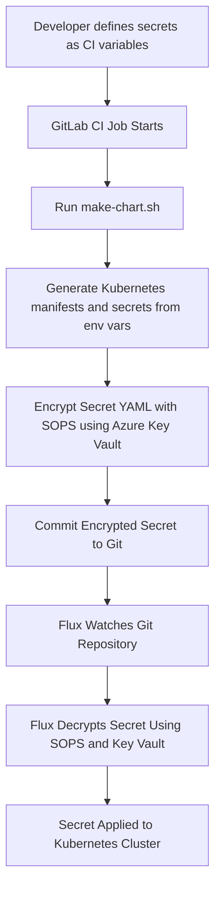

# Secrets Management with SOPS and CI

## Overview

This document outlines our strategy for managing Kubernetes secrets in our GitOps workflow using [SOPS](https://github.com/getsops/sops), GitLab CI, and Azure Key Vault. Our goal is to encrypt all secret values before they are committed to version control, supporting a workflow that is auditable, secure, and automation-friendly.

---

## Why This Approach?

- **Visibility**: All changes to secrets are captured in Git history. This enables traceability and auditability, both critical for compliance and debugging.
- **Simplicity**: We reduce infrastructure dependencies by avoiding in-cluster operators. The secrets lifecycle is managed through Git and CI/CD.
- **Access Control**: GitLab provides granular controls over repository access and CI/CD environment variables, centralizing responsibility.
- **Automation**: Secrets are generated from environment variables in CI, encrypted with SOPS using a key stored in Azure Key Vault, and then committed back to the repository.

---

## Secrets Flow

1. Secrets are defined via environment variables.
    - During local testing, variables read from an env file can be used to generate kubernetes secrets, eliminating the need to create them before generating the chart.
    - SOPS then encrypts each secret using keys from our selected key vault.
2. **GitLab CI job** runs the `make-chart` script which:
   - Renders the Helm chart from Dhall or templates.
   - Extracts secret values from environment variables.
   - Writes Kubernetes `Secret` YAML files to disk.
   - Encrypts them with SOPS using Azure Key Vault.
3. The encrypted secrets are committed and pushed back to the polar-deploy repository.
4. Flux watches the repository, decrypts secrets using SOPS with access to the same Key Vault, and applies them to the cluster.

---

## Encryption Details

- Secrets are encrypted using a **KMS key from Azure Key Vault**.
- The `.sops.yaml` policy defines which files to encrypt and how (e.g., by file path or pattern).
- Decryption in CI and Flux is handled by giving them identities that can access the Key Vault.

---


## Re-encrypting Secrets After Key Rotation

When a key in Azure Key Vault is rotated, any secrets previously encrypted with the old key must be re-encrypted using the new key to remain decryptable by Flux.

To do this:

1. **Update the SOPS configuration**: Update your `.sops.yaml` or `.sops.yml` file to reference the new Azure Key Vault key ID.
2. **Decrypt all secrets**: Use SOPS to decrypt existing secret files:
   ```sh
   sops -d secrets/my-secret.yaml > tmp && mv tmp secrets/my-secret.yaml
   ```
3. **Re-encrypt with the new key**: Re-run SOPS with the updated config to encrypt secrets:
   ```sh
   sops -e -i secrets/my-secret.yaml
   ```
   We will later automate this process for all secret files using a Taskfile and some scripting.

4. **Commit the changes**: Once re-encrypted, commit the updated files. This will create Git churn, which is expected and acceptable—secret changes should always be auditable.
5. **Flux will detect the change**: Flux will apply the updated, decryptable secrets using the new key in its environment.

This process can be incorporated into a CI job or a manually triggered script to simplify operational workflows and ensure secrets remain valid after key rotation.


---

## Summary

### ✅ Pros
- **Immutable history** of secrets changes with full context.
- **No need to run or trust in-cluster secret operators** (e.g., External Secrets or Sealed Secrets).
- **CI/CD flow remains declarative and secure**, aligning with GitOps principles.
- **Flexible key rotation**, since encryption is externalized via Key Vault.

### ❌ Cons
- **Key management complexity** must be handled externally (e.g., securely rotating keys in Azure).
- **Encrypted files will still create Git churn**, though this is considered a feature for visibility, all changes need to be auditable and justified.
- **Some manual overhead**, especially around tooling setup and file generation if not automated properly.

---

## Future Considerations

If our trust model changes or we begin adopting external secret backends in other systems (e.g., HashiCorp Vault, AWS Secrets Manager), we may consider moving to [External Secrets Operator](https://external-secrets.io) for a more dynamic pull-based model.

