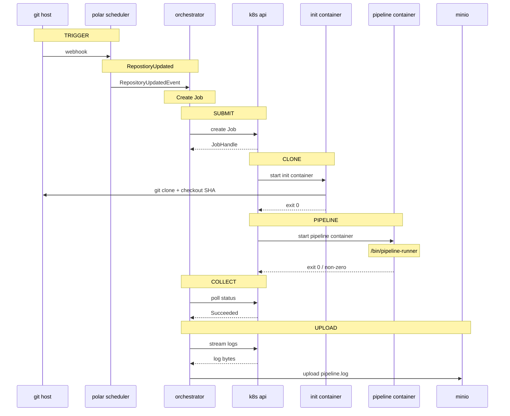

# Cyclops Build Orchestrator

Authoritative Build Runner for the Polar DevSecOps observability platform.

## Workspace Layout

```
build-orchestrator/
  ├── core/                 # domain types, traits, errors, events
  │   └── src/
  │       ├── backend.rs            # BuildBackend trait + handle/status types
  │       ├── error.rs              # CyclopsError, BackendError
  │       ├── events.rs             # CyclopsEvent, Cassini subjects
  │       └── types.rs              # BuildRequest, BuildRecord, BuildState, BuildSpec
  │
  ├── orchestrator/         # actor tree, config, Cassini integration
  │   └── src/
  │       ├── actors/
  │       │   ├── supervisor.rs     # OrchestratorSupervisor — root of the actor tree
  │       │   ├── build_registry.rs # BuildRegistryActor — serialized in-memory state
  │       │   └── build_job.rs      # BuildJobActor — owns one build's full lifecycle
  │       ├── cassini.rs            # CassiniPublisher trait + LoggingPublisher stub
  │       ├── config.rs             # OrchestratorConfig — loaded from file + env
  │       └── main.rs               # process entrypoint
  │
  └── k8s/          # Kubernetes BuildBackend implementation
      └── src/
          ├── backend.rs            # KubernetesBackend — kube-rs client wrapper
          └── job.rs                # Job manifest builder + status interpreter
```

## Running Locally (dev mode)

**NOTE** This assumes you've done the workspace wide setup of configuring environment variables, and standing up the necessary infrastructure, including Cassini, Neo4j, and a Kubernetes cluster.

Startup the build processor, it will attempt to connect to Cassini and ready itself to connect to a neo4j database, much like other graph clients and processors.

```sh
cargo run -p build-processor

```

Set `CYCLOPS_DEV_MODE=1` to inject a synthetic BuildRequest and emit build events to Cassini.

```bash
CYCLOPS_DEV_MODE=1 cargo run -p build-orchestrator
```

**NOTE**: Config is loaded from `cyclops.yaml` in the working directory by default. set `CYCLOPS_CONFIG= path/to/cyclops.yaml` to use a specific configuration

You'll need a kubeconfig pointing at a cluster. It should be bootstrapped with the desired namespace. Jobs will be submitted to the default namespace if one is not specified in cyclops.yaml

```bash
# optionally , create a namespace
# kubectl create namespace polar-builds
CYCLOPS_DEV_MODE=1 cargo run -p build-orchestrator
```


## Actor Supervision Tree

```
OrchestratorSupervisor
├── BuildRegistryActor          (singleton, serializes all state mutations)
└── BuildJobActor per build     (spawned on demand, stops on terminal state)
```

## Cassini Topic Convention

```

polar.git.repositories.events    | Git Commit Processor → Build Orchestrator

polar.builds.orchestrator.events | Build Orchestrator -> Build Processor

```


## State Machine

```
Pending → Scheduled → Running → Succeeded
                              ↘ Failed
        ↘ Cancelled (from any non-terminal state)
```

### Sequence 

