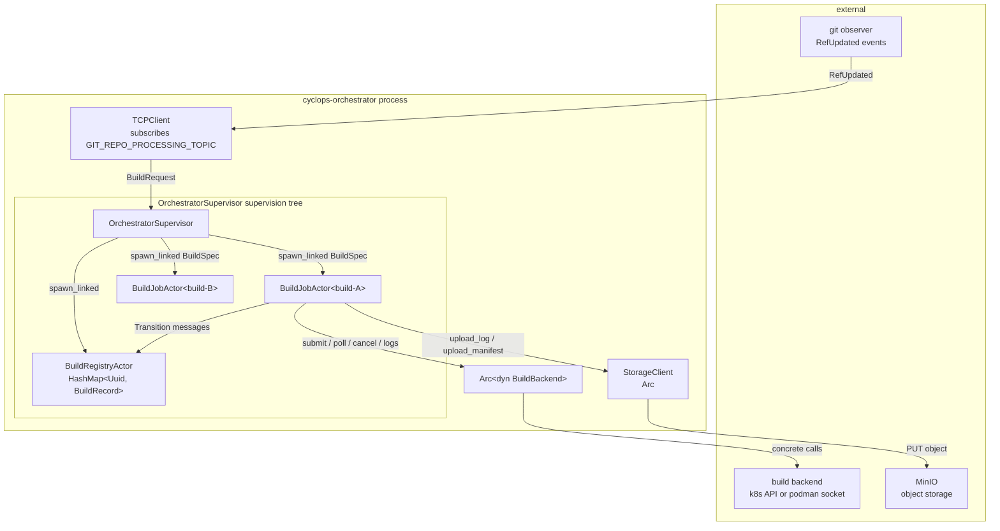
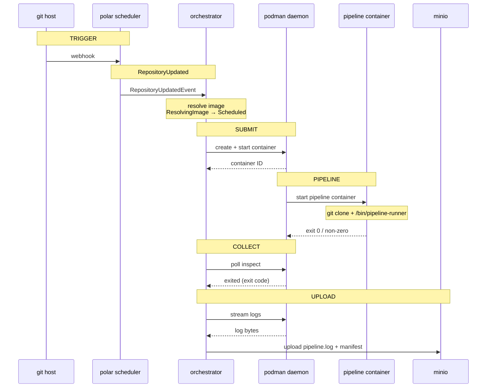

# Cyclops Build Orchestrator

**NOTE**: Cyclops was created as part of a SPIKE to see what an authoritative builder would look like, but it has since been moved to a "low maintence mode" to avoid maitnaining a full CI/CD system while trying to implement our observability framework."

Cyclops is the authoritative build runner for the Polar DevSecOps observability platform. Its job is narrow and deliberate: receive a commit reference, execute the associated pipeline in a controlled environment, and produce a signed, traceable record of what was built, from what source, and what was produced. Every build record Cyclops emits is a provenance node in Polar's knowledge graph — the authoritative answer to "what is actually running and where did it come from."

Cyclops is not a general-purpose CI system. It does not manage pipelines declaratively, schedule deployments, or orchestrate services. It runs one thing: the per-repo pipeline runner image, against a specific commit SHA, and records the outcome with enough fidelity that Polar can answer provenance questions without guessing.

## Why Cyclops Exists

Most commercial CI tooling is optimized for workflow orchestration and developer ergonomics. This makes them poor sources of truth for provenance data. They record what was *requested* rather than what *happened*, and they scatter that information across logs, webhook payloads, and platform-specific APIs that are expensive to query and often inconsistent at scale.

Polar needs to answer questions like "what is deployed right now," "what commit produced that artifact," and "was this build environment trustworthy when this artifact was produced." None of those questions are reliably answerable from standard CI tooling at the fidelity required. Cyclops exists to close that gap by owning the instrumentation at the point where the authoritative events occur.

## Workspace Layout

```
build-orchestrator/
  ├── core/                 # domain types, traits, errors, events
  │   └── src/
  │       ├── backend.rs    # BuildBackend trait + handle/status types
  │       ├── error.rs      # CyclopsError, BackendError
  │       ├── events.rs     # CyclopsEvent, Cassini subjects
  │       └── types.rs      # BuildRequest, BuildRecord, BuildState, BuildSpec
  │
  ├── orchestrator/         # actor tree, config, Cassini integration
  │   └── src/
  │       ├── actors/
  │       │   ├── supervisor.rs     # OrchestratorSupervisor — root of actor tree
  │       │   ├── build_registry.rs # BuildRegistryActor — serialized in-memory state
  │       │   └── build_job.rs      # BuildJobActor — owns one build's full lifecycle
  │       ├── cassini.rs    # CassiniPublisher trait + LoggingPublisher stub
  │       ├── config.rs     # OrchestratorConfig — loaded from file + env
  │       └── main.rs       # process entrypoint
  │
  ├── k8s/                  # Kubernetes BuildBackend implementation
  │   └── src/
  │       ├── backend.rs    # KubernetesBackend — kube-rs client wrapper
  │       └── job.rs        # Job manifest builder + status interpreter
  │
  └── podman/               # Podman BuildBackend implementation
      └── src/
          ├── backend.rs    # PodmanBackend — bollard client over Unix socket
          ├── container.rs  # container lifecycle: create, start, inspect, stop, logs
          ├── image.rs      # image pull and presence check with pull policy
          └── error.rs      # PodmanError — maps exhaustively to BackendError
```

## Architecture

The orchestrator is a single long-running process built on an actor supervision tree. The entry point bootstraps configuration, selects and connects a backend, establishes storage and broker connections, then hands off entirely to the actor tree.

- `main.rs` bootstraps config, constructs the configured backend behind `Arc<dyn BuildBackend>`, and spawns two top-level actors: `OrchestratorSupervisor` and `TCPClient`.
- `TCPClient` subscribes to the git processing topic on Cassini, converts `RefUpdated` events into `BuildRequest`s, and forwards them to the supervisor. It is a sibling of the supervisor tree — not a child — so a broker disconnect does not cascade into in-flight build failures.
- `OrchestratorSupervisor` owns two children: `BuildRegistryActor` (singleton, serializes all state mutations) and one `BuildJobActor` per active build (spawned on demand, stops itself on terminal state).
- `BuildJobActor` drives the build state machine, calls the `BuildBackend` trait for all execution operations, and on reaching a confirmed terminal state writes the `BuildRecord` to `StorageClient`.
- The backend is an `Arc<dyn BuildBackend>` — the actor tree has no knowledge of whether it is talking to Kubernetes or Podman.



## Build Backends

The `BuildBackend` trait abstracts over execution environments. The orchestrator selects a backend at startup from configuration and never re-examines the choice at runtime. The actor tree holds `Arc<dyn BuildBackend>` and calls the same four methods — `submit`, `poll`, `cancel`, `logs` — regardless of which backend is active.

### Kubernetes

Submits builds as Kubernetes `Job` resources. Each Job has a git-clone init container that checks out the source into a shared `emptyDir` volume, followed by the pipeline container that runs `/bin/pipeline-runner` against the workspace.

Requires a reachable Kubernetes API server. This makes it unsuitable for environments where the API server is centrally hosted and may be unreachable during a network partition.

Configured via `[backend] kind = "kubernetes"` in `cyclops.yaml`.

### Podman

Submits builds as rootless Podman containers via the Docker-compatible Unix socket API (`bollard`). No network path to any remote API server is required for job execution — the only dependency is the local Podman daemon. This makes it the correct choice for air-gapped or partition-tolerant enclave deployments.

The pipeline container receives `CYCLOPS_BUILD_ID`, `CYCLOPS_REPO_URL`, and `CYCLOPS_COMMIT_SHA` as environment variables and is responsible for its own git clone. The Kubernetes init-container clone pattern does not apply here.

Configured via `[backend] kind = "podman"` in `cyclops.yaml`. The Podman socket service must be running: `systemctl --user enable --now podman.socket`.

## Build State Machine

A build progresses through two phases: image resolution and execution. Image resolution determines whether the pipeline image for this repo already exists in the registry, and if not, runs a bootstrap job to build it. Execution runs the actual pipeline against the resolved image and commit.

```
Pending
  └─► ResolvingImage
        ├─► Bootstrapping       (pipeline image absent — bootstrap job running)
        │     └─► Scheduled
        └─► Scheduled           (pipeline image present — proceed directly)
              └─► Running
                    ├─► Succeeded
                    └─► Failed

Cancelled    reachable from any non-terminal state
Unreconciled reachable from Scheduled, Bootstrapping, Running
             backend connectivity was lost while job was in-flight;
             requires reconciliation on reconnect before a new record is issued
```

`Unreconciled` is not a permanent terminal state. On backend reconnect, `BuildJobActor` attempts to recover the actual outcome from the backend and resolves to `Succeeded` or `Failed`. Any `BuildRecord` remaining `Unreconciled` beyond the configured TTL is surfaced as a Polar alert — an unresolved provenance gap requires human attention.

`StorageClient` writes only on a confirmed terminal state (`Succeeded` or `Failed`). It never writes on `Unreconciled`.

## Actor Supervision Tree

```
OrchestratorSupervisor
├── BuildRegistryActor          (singleton — serializes all state mutations)
└── BuildJobActor per build     (spawned on demand — stops itself on terminal state)
```

`BuildRegistryActor` is the sole writer to the in-memory `HashMap<Uuid, BuildRecord>`. All state transitions go through it. `BuildJobActor` instances send transition messages to the registry rather than mutating shared state directly — this is what makes the state model safe under concurrent builds without locks.

## Cassini Topic Convention

```
polar.git.repositories.events      Git Commit Processor  →  Build Orchestrator
polar.builds.orchestrator.events   Build Orchestrator    →  Build Processor
```

## Configuration

Config is loaded from `cyclops.yaml` in the working directory by default. Override with `CYCLOPS_CONFIG=/path/to/cyclops.yaml`.

```yaml
# Backend selection. Exactly one backend is active per process instance.
backend:
  kind: podman                        # "podman" or "kubernetes"

  podman:
    socket_path: /run/user/1000/podman/podman.sock
    image_pull_policy: IfNotPresent   # Always | IfNotPresent | Never

  kubernetes:
    namespace: polar-builds           # must exist before startup
```

## Running Locally

### With the Podman backend

Podman requires no cluster. Ensure the Podman socket service is running for your user:

```sh
systemctl --user enable --now podman.socket
```

Configure `cyclops.yaml` with `backend.kind = "podman"` and run:

```sh
cargo run -p build-orchestrator
```

Set `CYCLOPS_DEV_MODE=1` to inject a synthetic `BuildRequest` without a live Cassini broker:

```sh
CYCLOPS_DEV_MODE=1 cargo run -p build-orchestrator
```

### With the Kubernetes backend

Requires a reachable cluster and a `kubeconfig` in the standard location (or `KUBECONFIG` set). The target namespace must exist:

```sh
kubectl create namespace polar-builds
CYCLOPS_DEV_MODE=1 cargo run -p build-orchestrator
```

### Build processor

The build processor consumes events emitted by the orchestrator and writes provenance edges to Neo4j. Run it alongside the orchestrator in dev:

```sh
cargo run -p build-processor
```

## Sequence (Podman backend)


