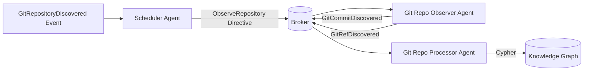

# Git Agents – Developer README

This document describes the Git ingestion pipeline implemented as a set of cooperating agents. The system is event-driven, broker-mediated, and designed for strict separation of concerns between discovery, scheduling, repository introspection, and persistence into the knowledge graph.

---

## High-Level Architecture

The Git subsystem is composed of three primary agents:

1. **Scheduler Agent**
2. **Git Repository Observer Agent**
3. **Git Repository Processor Agent**

All inter-agent communication occurs over the broker. There are no direct in-process calls between agents.

### Responsibilities

#### Scheduler Agent

The scheduler reacts to `GitRepositoryDiscovered` events. Upon receiving such an event, it:

* Applies policy (e.g., deduplication, rate limiting, tenancy boundaries).
* Emits a directive instructing the Git Repository Observer to clone and analyze the repository.
* Does not perform cloning or repository introspection itself.

It is strictly orchestration logic.

#### Git Repository Observer Agent

The observer is responsible for:

* Cloning repositories (using the credential provider abstraction).
* Caching repositories locally.
* Walking the commit DAG.
* Enumerating refs (branches, tags, etc.).
* Emitting normalized domain events:

  * `GitCommitDiscovered`
  * `GitRefDiscovered`
  * (and any future structural Git entities)

It performs no persistence.

#### Git Repository Processor Agent

The processor consumes commit/ref events and:

* Transforms them into Cypher.
* Persists repository, commit, and ref nodes/relationships into the knowledge graph.
* Enforces graph-level idempotency and structural constraints.

It performs no Git operations.

---

## Event Flow

All communication is broker-mediated.



---

## Event Model

### Discovery

```rust
GitRepositoryDiscovered {
    repository_id: RepositoryId,
    canonical_url: String, // Option A: scheduler chooses the canonical transport
}
```

The scheduler chooses a single canonical URL (e.g., SSH preferred over HTTPS if available). The observer does not perform transport negotiation.

### Observer Output

```rust
GitCommitDiscovered {
    repository_id: RepositoryId,
    commit_sha: String,
    parents: Vec<String>,
    author: Signature,
    committer: Signature,
    message: String,
    authored_at: DateTime<Utc>,
    committed_at: DateTime<Utc>,
}

GitRefDiscovered {
    repository_id: RepositoryId,
    ref_name: String,
    target: String, // commit SHA
    kind: RefKind,  // Branch | Tag | Other
}
```

These events are immutable, append-only, and designed for replay safety.

---

## Design Principles

### 1. Strict Agent Isolation

Each agent:

* Owns a single bounded responsibility.
* Communicates only via the broker.
* Can be horizontally scaled independently.

### 2. Idempotency

* The observer may emit duplicate commit/ref events.
* The processor must enforce idempotent persistence at the graph layer.

### 3. Replayability

All events are durable and replayable. The processor must tolerate reprocessing.

### 4. Canonical Transport Selection

The scheduler selects a single canonical URL before emitting directives. The observer assumes the URL is final and authoritative.

---

## Credential Provider Integration

The observer does not embed credential logic directly. Instead, it depends on an abstraction:

```rust
pub trait GitCredentialProvider {
    fn credentials_for(&self, url: &str) -> Result<GitCredentials>;
}
```

This ensures:

* Dry separation of authentication from repository walking.
* Unit-testability (inject mock providers).
* Pluggability (SSH, HTTPS, token-based, ephemeral credentials).

---

## Local Repository Caching

The observer:

* Clones into a deterministic cache directory (e.g., derived from repository ID hash).
* Performs fetch if repository already exists.
* Never assumes clean state; always tolerates partial clone state.
* Avoids destructive operations.

Cache invalidation strategy is currently manual/policy-driven and not automatic.

---

## Usage (Stub)

### Running the Scheduler

```bash
cargo run -p git-scheduler-agent
```

Expected behavior:

* Subscribes to `GitRepositoryDiscovered`.
* Emits `ObserveRepository` directives.

### Running the Observer

**Setup**
The Git Observer is configured via a JSON file in a similar fashion to many docker-compatible tooling.
The structure is as follows. 

```json
{
  "hosts": {
    "gitlab.com": {
      "http": {
        "username": "username",
        "token": "token"
      }
    }
  }
}
```
Ensure one of these files exists before running the agent.

```bash
## Ensure you set the environment variable to point the agent to a json file containing necessary credentials.
export GIT_AGENT_CONFIG="git.json"
cargo run -p git-repo-observer
```

Expected behavior:

* Subscribes to observe directives.
* Clones repository.
* Emits commit/ref events.

### Running the Processor

```bash
cargo run -p git-repo-processor
```

Expected behavior:

* Subscribes to commit/ref events.
* Writes to Neo4j (or configured graph backend).

---

## Testing Strategy

### Unit Testing

Each agent should:

* Mock the broker interface.
* Mock the credential provider (observer only).
* Validate emitted events given deterministic inputs.

### Integration Testing

1. Spin up:

   * Cassini 
   * Test Neo4j container
   * Some Agent that can Emit `GitRepositoryDiscovered`, for example, the gitlab observer and consumer.
3. Assert:
   * Repository node exists.
   * Commit count matches fixture repository.
   * Refs correctly linked.

Testcontainers are recommended for isolation.

### Replay Testing

Re-inject identical commit events and verify:

* No duplicate nodes.
* No duplicate relationships.
* Graph invariants preserved.

---

## Operational Considerations

* The observer is CPU and IO heavy (clone + DAG traversal).
* The processor is graph-bound and may require batching.
* Backpressure should be handled at the broker layer.
* Horizontal scaling must consider repository-level locking to avoid duplicate clone races.

---

## Future Extensions

* Transport negotiation abstraction (multi-URL support).
* Incremental fetch-only mode.
* Commit delta emission.
* Distributed repository shard scheduling.
* Backfill and replay tooling.
